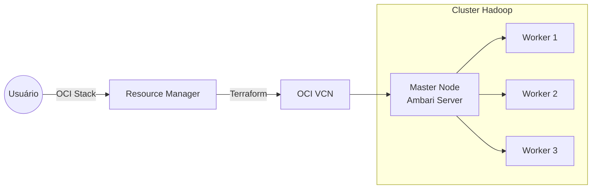

# Automação de Data Lake CDP na Oracle Cloud

Bem-vindo à documentação oficial do projeto de automação **CDP (Cloudera/Open Data Platform)** na **OCI**. Este projeto oferece uma solução "Infrastructure as Code" completa para implantar um cluster Hadoop seguro, escalável e pronto para produção em minutos.

   

---

##  Visão Geral

O objetivo deste projeto é eliminar a complexidade da instalação manual de clusters Big Data. Utilizando **Terraform** para infraestrutura e **Ansible** para configuração, entregamos um ambiente **Apache Ambari** totalmente funcional com serviços como HDFS, YARN, Hive, Spark e Ranger pré-configurados.

### Principais Diferenciais
*   **Zero-Touch Deployment**: De `terraform apply` até o cluster rodando sem intervenção humana.
*   **OCI Stacks**: Integração nativa com o Oracle Resource Manager para deploy via interface web.
*   **Segurança First**: Security Lists configuradas, chaves SSH gerenciadas e serviços internos isolados.

---

##  Arquitetura

O deploy provisiona uma VCN com subnets otimizadas e instâncias Compute (Ampere A1) interconectadas.

---

## Documentação Completa

Aprofunde-se nos detalhes técnicos e operacionais através dos nossos guias:

###  Começando
*   **[Resumo Executivo](https://github.com/Ecosystem-CDP/docs/blob/main/docs/03%20-%20CDP/01-resumo-executivo.md)**: Entenda o escopo e os componentes da solução.
*   **[Guia de Deploy via OCI Stacks](https://github.com/Ecosystem-CDP/docs/blob/main/docs/03%20-%20CDP/07-guia-deploy-oci-stacks.md)**: **(Recomendado)** O passo a passo mais simples para subir seu cluster.

###  Técnico & Operação
*   **[Guia Técnico de Automação](https://github.com/Ecosystem-CDP/docs/blob/main/docs/03%20-%20CDP/02-guia-tecnico-automacao.md)**: Como o Terraform e Ansible trabalham juntos.
*   **[Arquitetura e Fluxo](https://github.com/Ecosystem-CDP/docs/blob/main/docs/03%20-%20CDP/04-arquitetura-fluxo.md)**: Diagramas detalhados do provisionamento.
*   **[Manual de Debug](https://github.com/Ecosystem-CDP/docs/blob/main/docs/03%20-%20CDP/03-manual-debug.md)**: O que fazer se algo der errado.

###  Referência
*   **[Credenciais e Senhas](https://github.com/Ecosystem-CDP/docs/blob/main/docs/03%20-%20CDP/05-senhas-credenciais.md)**: Acessos padrão do ambiente.
*   **[Scripts de Referência](https://github.com/Ecosystem-CDP/docs/blob/main/docs/03%20-%20CDP/06-scripts-referencia.md)**: Utilitários para o dia a dia.

---

## Contribuição

Este é um projeto Open Source. Sinta-se à vontade para abrir Issues ou Pull Requests no nosso repositório para melhorias na automação ou documentação.

---
*Gerado automaticamente para apresentação via GitHub Pages.*
